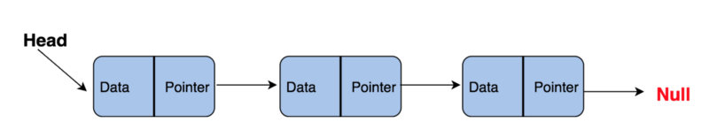

## Estruturas de dados com Flask

#### Desenvolvi essas APIs com o intuito de consolidar meu conhecimento  de estruturas de dados. Além disso, usar as estruturas de dados no desenvolvimento prático com um cenário real foi uma experiência de aprendizado muito proveitosa.
##### No desenvolvimento deste projeto utilizei bibliotecas externas, tais como: Flask, SQLAlchemy, Flask-SQLAlchemy e Faker.

#### Utilizei de LinkedLists, HashTables, arvores de busca binária, filas e pilhas!

Estruturas de Dados são métodos de organização de dados. E como os dados são um dos ativos, senão o ativo, mais importante do ramo da computação, entender essas estruturas e suas funcionalidades é de suma importância!

As APIs aqui desenvolvidas, tem como plano de fundo um blog, com usuários e posts, porém o verdadeiro intuito é compreender as estruturas de dados presentes.

A primeira API presente no [server.py](server.py) tem a funcionalidade de cadastrar um novo usuário (note que foi configurado a conexão com um banco de dados sqlite e criado dois modelos, `User` e `BlogPost`, consulte o código para melhor entendimento).

As seguintes duas APIs vão utilizar de uma LinkedList ou Lista Encadeada para retornar uma listagem dos usuários em ordem crescente ou decrescente.

### LinkedList ou Lista Encadeada:
Essa estrutura, é algo como uma lista linear, um pouco parecida com um Array, porém se difere em muitos aspectos, como principalmente alocação de memória. Um array é uma lista indexada, de tamanho fixo, uma LinkedList não possui index, nem tamanho fixo.
A organização dos dados em uma LL, chamados de Nodes, denota que cada dado é dividido em duas partes: Uma parte contendo os dados de fato, e outra como um ponteiro para o seguinto Node:
```
class Node:
    def __init__(self, data=None, next_node=None):
        self.data = data
        self.next_node = next_node
```

[ Dados1 | Pointer ->] -> [ Dados 2 | Pointer ->] -> [ Dados 3 | Pointer ->] -> ........

Além disso, toda LL possui um atributo chamado Head, que nada mais é do que o primeiro Node a ser adicionado à ela, além disso na implementação desse projeto também defini um atributo last_node, que mantém armazenado o último Node da LL

```
class LinkedList:
    # nessa lista, teremos atributos do primeiro e do ultimo Node da lista, para facilitar a inserção nas extremidades
    def __init__(self):
        self.head = None
        self.last_node = None

```



Note também que sabemos qual o último nó quando ele aponta para Null.

Para remover ou inserir elementos, não precisamos deslocar todos os demais elementos, apenas mudar as referências de apontadores.

Na nossa LL, implementamos dois metodos de adição, um que adicionamos ao fim da lista:
```
    def insert_end(self,data):
        if self.head is None:
            self.insert_beginning(data)

        self.last_node.next_node = Node(data,None)
        self.last_node = self.last_node.next_node
```

E outro que adiciona ao início da lista:
```
    def insert_beginning(self,data):
        if self.head is None:
            self.head = Node(data,None)
            self.last_node = self.head
        new_node = Node(data,self.head)
        self.head = new_node
```

Para as funcionalidades da API, também foram implementados um método que atravessa a LL, buscando um id específico (para buscar usuários) e outro que transforma a LL em um array, para retornamos um JSON:
```

    def to_array(self):
        arr = []
        if self.head is None:
            return arr
        node = self.head
        while node.next_node:
            arr.append(node.data)
            node = node.next_node
        return arr
    
    #metodo que returna um nó com id específico
    def get_user_by_id(self,user_id):
        node = self.head
        while node:
            if node.data["id"] == int(user_id):
                return node.data
            node = node.next_node
```

### HashTable
...


Para fazer o uso da aplicação em sua máquina:
1. clone esse repositório
2. crie um ambiente virtual `env`
3. Instale as dependências do projeto com `pip`