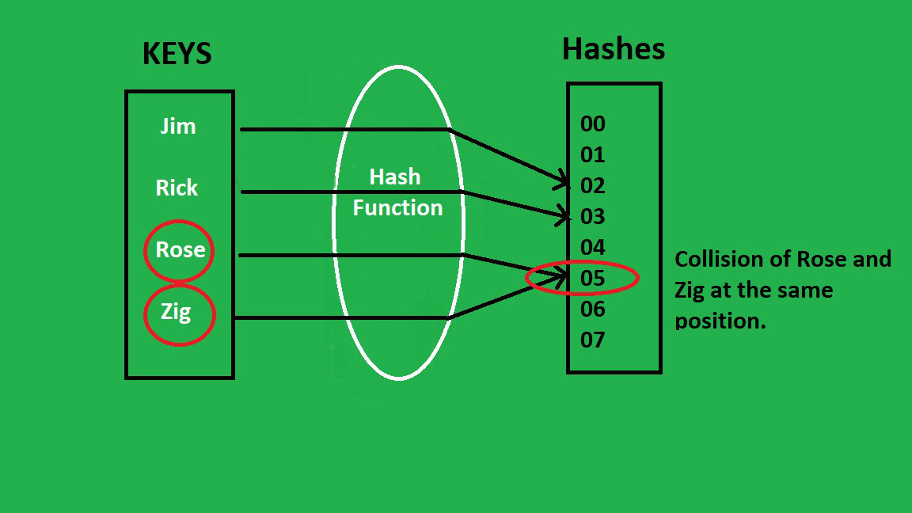

## Estruturas de dados com Flask

#### Desenvolvi essas APIs com o intuito de consolidar meu conhecimento  de estruturas de dados. Além disso, usar as estruturas de dados no desenvolvimento prático com um cenário real foi uma experiência de aprendizado muito proveitosa.
##### No desenvolvimento deste projeto utilizei bibliotecas externas, tais como: Flask, SQLAlchemy, Flask-SQLAlchemy e Faker.

#### Utilizei de LinkedLists, HashTables, arvores de busca binária, filas e pilhas!

Estruturas de Dados são métodos de organização de dados. E como os dados são um dos ativos, senão o ativo, mais importante do ramo da computação, entender essas estruturas e suas funcionalidades é de suma importância!

As APIs aqui desenvolvidas, tem como plano de fundo um blog, com usuários e posts, porém o verdadeiro intuito é compreender as estruturas de dados presentes.

A primeira API presente no [server.py](server.py) tem a funcionalidade de cadastrar um novo usuário (note que foi configurado a conexão com um banco de dados sqlite e criado dois modelos, `User` e `BlogPost`, consulte o código para melhor entendimento).

As seguintes duas APIs vão utilizar de uma LinkedList ou Lista Encadeada para retornar uma listagem dos usuários em ordem crescente ou decrescente.

### LinkedList ou Lista Encadeada:
Essa estrutura, é algo como uma lista linear, um pouco parecida com um Array, porém se difere em muitos aspectos, como principalmente alocação de memória. Um array é uma lista indexada, de tamanho fixo, uma LinkedList não possui index, nem tamanho fixo.
A organização dos dados em uma LL, chamados de Nodes, denota que cada dado é dividido em duas partes: Uma parte contendo os dados de fato, e outra como um ponteiro para o seguinto Node:
```
class Node:
    def __init__(self, data=None, next_node=None):
        self.data = data
        self.next_node = next_node
```

[ Dados1 | Pointer ->] -> [ Dados 2 | Pointer ->] -> [ Dados 3 | Pointer ->] -> ........

Além disso, toda LL possui um atributo chamado Head, que nada mais é do que o primeiro Node a ser adicionado à ela, além disso na implementação desse projeto também defini um atributo last_node, que mantém armazenado o último Node da LL

```
class LinkedList:
    # nessa lista, teremos atributos do primeiro e do ultimo Node da lista, para facilitar a inserção nas extremidades
    def __init__(self):
        self.head = None
        self.last_node = None

```


Note também que sabemos qual o último nó quando ele aponta para Null.

Para remover ou inserir elementos, não precisamos deslocar todos os demais elementos, apenas mudar as referências de apontadores.

Na nossa LL, implementamos dois metodos de adição, um que adicionamos ao fim da lista:
```
    def insert_end(self,data):
        if self.head is None:
            self.insert_beginning(data)

        self.last_node.next_node = Node(data,None)
        self.last_node = self.last_node.next_node
```

E outro que adiciona ao início da lista:
```
    def insert_beginning(self,data):
        if self.head is None:
            self.head = Node(data,None)
            self.last_node = self.head
        new_node = Node(data,self.head)
        self.head = new_node
```

Para as funcionalidades da API, também foram implementados um método que atravessa a LL, buscando um id específico (para buscar usuários) e outro que transforma a LL em um array, para retornamos um JSON:
```

    def to_array(self):
        arr = []
        if self.head is None:
            return arr
        node = self.head
        while node.next_node:
            arr.append(node.data)
            node = node.next_node
        return arr
    
    #metodo que returna um nó com id específico
    def get_user_by_id(self,user_id):
        node = self.head
        while node:
            if node.data["id"] == int(user_id):
                return node.data
            node = node.next_node
```

### HashTable
Hash tables ou tabelas de dispersão é uma estrutura que associa chaves a valores. Sua característica mais marcante é fazer buscas rápidas!

Primeiramente se usa uma função, chamada de função de espalhamento que gera um índice a partir da chave. Idealmente os índices são únicos para evitar colisões. 



 No caso de colisões, para que não haja tantos problemas utilizamos vetores de listas, onde caso o índice gerado pela chave, já possui um elemento, nós encadeamos, formando uma lista naquele índice:
 


 No nosso código de exemplo [hashTable.py](hashTable.py), geramos o índex através da função `ord()` que transforma o chave em unicode, além disso, definimos um comprimento fixo de índices no seu contrutor.

 Para adicionarmos valores, chamamos a função que gera o index, e atribuimos o valor naquele índice, e caso já haja items, nós atravessamos a lista, e encadeamos o valor:
 ```
    # definimod o tamanho para que o método que cria o hash não exceda o index da lista que passarmos
    def __init__(self,table_size):
        self.table_size = table_size
        self.hash_table = [None] * table_size

    def custom_hash(self,key):
        hash_value = 0
        for i in key:
            hash_value += ord(i) # me retorna o valor decimal do caractere
            hash_value = (hash_value*ord(i)) %self.table_size # garantimos que o hash não terá valores maior que o comprimento da lista
        return hash_value
    
    # adiciona valores na hashTable
    def add_key_value(self,key,value):
        hashed_key = self.custom_hash(key)
        if self.hash_table[hashed_key] is None:
            self.hash_table[hashed_key] = Node(Data(key,value),None) 
        else: # caso haja colisões implementamos uma linkedList:
            node = self.hash_table[hashed_key]
            while node.nextNode:
                node = node.nextNode
            node.nextNode = Node(Data(key,value),None)
 ```

 Para fazermos a busca é simples, já que nos é dado uma chave. Com a chave achamos o index, então basta acessarmos e index, e caso haja uma lista nós atravessamos a lista:
 ```
    # procuramos o valor de determinada chave, em O(1)
    def get_value(self, key):
        hashed_key = self.custom_hash(key)
        if self.hash_table[hashed_key] is not None:
            node = self.hash_table[hashed_key]
            if node.nextNode is None:
                return node.data.value
            while node.nextNode:
                if key == node.data.key:
                    return node.data.value
                node = node.nextNode

            if key == node.data.key:
                return node.data.value
            
 ```
 Implementamos a hashtable para criarmos posts do blog, de determinados usuários, usando hashes para guardar os atributos do post, como título, corpo, data e id do usuário, depois nós buscamos as informações do post e criamos um objeto para inserirmos no banco de dados:
 ```
# implementaremos HashTables na rota a seguir:
@app.route("/blog_post/<user_id>",methods=["POST"])
def create_blog_post(user_id):
    data = request.get_json()

    user = User.query.filter_by(id = user_id).first()
    if not user:
        return jsonify({"message": "user does not exist"}),400
    
    ht = hashTable.HashTable(10)

    ht.add_key_value("title",data["title"])
    ht.add_key_value("body",data["body"])
    ht.add_key_value("date",now)
    ht.add_key_value("user_id",user_id)

    new_blog_post = BlogPost(title = ht.get_value("title"),body = ht.get_value("body"),date = ht.get_value("date"),user_id = ht.get_value("user_id"))

    db.session().add(new_blog_post)

    db.session().commit()
    return jsonify("message: blog post created"),200
 ```

 ### Árvore de Busca Binária ou Binary Search Tree

Uma **árvore** é uma estrutura de dados composta de nós, com as seguintes características:

1. Cada árvore tem um nó raiz em seu ponto superior (também conhecido como Nó Pai) contendo algum valor (com qualquer tipo de dados).
2. O nó raiz tem zero ou mais "nós filhos".
3. Cada nó filho tem zero ou mais "nós filhos" e assim por diante. Isso cria uma subárvore interna à árvore. 
4. Cada nó tem sua própria subárvore feita dos filhos e dos filhos dos filhos e assim por diante. Isso quer dizer que cada nó pode ser uma árvore por si só.


##### Uma árvore binária de busca tem, além disso, as duas características abaixo, para favorecer o algoritmo de busca binária:

1. Cada nó pode ter, no máximo, dois filhos.
2. Para cada nó, os valores de seus descendentes da esquerda são inferiores ao valor do nó atual, que, por sua vez, é inferior aos nós descendentes da direita (se existirem).


No nosso exemplo de cósigo [binarySearchTree.py](binarySearchTree.py), temos uma alteração na estruturação do Node dessa vez, já que ele aponta para outros dois:
```
class Node:
    # os nodees apontam para outros dois, esquerda e direita
    def __init__(self,data=None):
        self.data = data
        self.left = None
        self.right = None
```
 Para inserir, nós comparamos o valor a ser inserido com o valor presente e vamos atravessando a árvore até chegarmos a um vazio, e ali inserimos o Node e modificamos os apontadores, no nosso exemplo usamos recursão:
 ```
    # aqui estamos implementando uma função recursiva para adicionar nodes
    # assim a estrutura da arvore favorece a busca binaria, não sendo necessaria varias iterações
    def _insert_recursive(self,data,node):
        # uma arvore binaria tem seus nós da esquerda como menores que os pais
        if data["id"] < node.data["id"]:
            if node.left is None:
                node.left = Node(data)
            else:
                self._insert_recursive(data,node.left)
        # e os nós da direita como maiores
        elif data["id"]> node.data["id"]:
            if node.right is None:
                node.right = Node(data)
            else:
                self._insert_recursive(data, node.right)
        else:
            return

    def insert(self,data):
        if self.root is None:
            self.root = Node(data)
        else:
            self._insert_recursive(data,self.root)
 ```

 Para a busca usamos o mesmo método:
 ```
    # implementamos uma busca binaria recursiva:
    def _search_recursive(self, blog_post_id, node):

        if blog_post_id == node.data["id"]:
            return node.data

        if blog_post_id < node.data["id"] and node.left is not None:
            return self._search_recursive(blog_post_id, node.left)

        if blog_post_id > node.data["id"] and node.right is not None:
            return self._search_recursive(blog_post_id, node.right)

        return False

    def search(self, blog_post_id):
        blog_post_id = int(blog_post_id)
        if self.root is None:
            return False

        return self._search_recursive(blog_post_id, self.root)
 ```


Para fazer o uso da aplicação em sua máquina:
1. clone esse repositório
2. crie um ambiente virtual `env`
3. Instale as dependências do projeto com `pip`